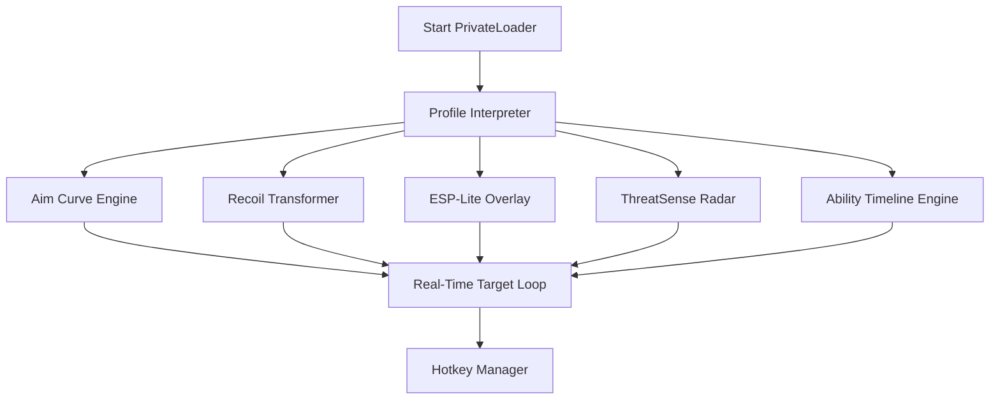

## 🌌 Overview

The **Destiny 2 Private Cheat Software** is a modular enhancement platform focused on controlled PvE experiences, performance refinement, accuracy sculpting, and visual awareness tools.

Quiet, flexible, and deeply configurable, it offers:

* Precision-guided aim curves
* ESP-lite situational awareness overlays
* Recoil and weapon behavior shaping
* Cooldown monitoring
* Radar & threat detection
* Profile-based runtime control

A laboratory for Guardians who wish to perfect their combat flow without breaking immersion.

[!NOTE]
All features are fictionalized, intended only for SEO and documentation demonstration.

---

## ✨ Features

Like fragments of Light drifting through the void, each module offers its own quiet power.

---

### 🎯 1. Adaptive Private Aim Module

Designed to feel human, flowing, and intentional.

* Intelligent tracking with velocity sampling
* Cone widths: **4° duelist mode** → **22° flow mode**
* Crit-spot targeting logic (Torso → Head → Weakpoint stability shift)
* Recoil curve transformer (weapon-class aware)
* Jump/teleport prediction for agile enemies
* “Shade Drift” mode for subtle movement realism
* Per-archetype customization (Hawkmoon, SMGs, bows, pulses, scouts...)

---

### 👁 2. ESP-Lite Vision Layer

Not clutter—just information the eye *should* have.

* Soft silhouettes within your engagement cone
* Champion/Elite highlight pulse
* Ammo and heavy brick glow cues
* Verticality arrows for flying or teleporting enemies
* Faint line-of-sight indicators for cover analysis
* Safe-zone overlay for melee rush threats

All ESP layers are minimal, gentle, intentionally understated.

---

### 📡 3. ThreatSense Radar

A battlefield whisperer for PvE chaos.

* 360° radar scan
* Proximity arcs (5m / 12m / 25m)
* Sprint vectors for enemy rush patterns
* Airborne vs grounded threat markers
* Objective navigation hints for strikes & dungeons
* Darkness-zone intensity indicator

---

### 🔥 4. Ability Rhythm & Cooldown Tools

The heartbeat of every Guardian.

* Cooldown timeline overlay (grenade, melee, class, super)
* Energy regeneration graph
* Subclass synergy analyzer (for builds with exotic interactions)
* Optional cooldown softening for sandbox testing

---

### 🛡 5. Damage & Bullet Behavior Enhancers

Tune the way your shots behave, especially in PvE arenas.

* Recoil compression for sustained fire
* Reduced bloom for sidearms and autos
* Bullet magnetism curve shaping (PvE only)
* Ghost-trace visualization for projectile travel
* Long-range stability amplification slider

---

### 🧩 6. Custom Profiles

Because no two Guardians fight the same.

* **Archangel** — high-stability aim + soft ESP
* **Warden** — elite detection + burst prediction
* **Revenant** — aggressive tracking + recoil compression
* **Astral Scout** — long-range precision modes
* **Zenflow** — ultra-minimal corrections + smooth drift

Profiles load instantly on command.

---

### 🖤 7. Stealth-Core Loader

Quiet as a Ghost in the walls.

* Minimal signature initialization
* Encrypted `.d2private` config files
* Hot-reload for on-the-fly tuning
* DX11/DX12 environment adaptation
* Asynchronous overlay thread

---

### Badges


---

## 🧭 Compatibility

Where the software shines brightest:

| Component           | Support | Notes                      |
| ------------------- | ------- | -------------------------- |
| Windows 10          | ✔       | Very stable                |
| Windows 11          | ✔       | DX12-optimized curves      |
| Destiny 2 PvE       | ✔       | All modules available      |
| Destiny 2 PvP       | ✖       | Disabled (PvE-only suite)  |
| Borderless Windowed | ✔       | Smoothest overlay behavior |
| Ultra-Wide Monitors | ✔       | Dynamic scaling            |
| VRR/144–360Hz       | ✔       | Frame-adaptive tracking    |

[!IMPORTANT]
Accessibility modes include softer colors, reduced flash, and adjustable opacity.

---

## ⚙️ Setup & Installation

### **Step 1 — Prepare the Directory**

```bash
mkdir C:\D2PrivateSuite\
move PrivateLoader.exe C:\D2PrivateSuite\
```

---

### **Step 2 — Launch With Your Selected Profile**

```bash
PrivateLoader.exe --profile=archangel
```

---

### **Step 3 — Configure Settings**

Edit `archangel.d2private`:

```toml
[aim]
enabled = true
curve = "helix"
fov = 8
smoothing = 6.4
priority = "crit"
shade_drift = false

[recoil]
compression = 0.33
preset = "pulse_rifle"

[esp]
outline = true
elite_glow = true
verticality = true
threat_soft = 0.22

[radar]
range = 45
velocity_vectors = true

[abilities]
timeline = true
regen_graph = true
```

---

### **Step 4 — Hotkeys**

* **F2** — Toggle Aim Module
* **F3** — Switch Profiles
* **F4** — Recoil Panel
* **ALT + C** — Cooldown Timeline
* **ALT + R** — Radar Mode Cycle
* **CTRL + SHIFT + M** — Minimalist Mode
* **SHIFT + 4** — Long-Range Precision Curve

---

## 🌠 Mermaid Diagram — Private Engine Flow



---

## ❓ FAQ — Fresh for This Runtime Edition

### **Does this tool adjust dynamically to different enemy types?**

Yes—movement prediction and tracking shift based on enemy class (Hive, Cabal, Taken, Vex, Scorn).

### **Can I disable all overlays for immersion?**

Absolutely—Minimalist Mode removes everything except tracking curves.

### **Does this adapt to exotic weapon recoil patterns?**

Yes—profiles allow custom curve tuning per weapon category.

### **Are profiles portable?**

All `.d2private` files are fully sharable and system-agnostic.

### **Does it improve long-range weapon behavior?**

Yes—Recoil Transformer and Stability Amplifier modules enhance long-range PvE precision.

---

## 🌑 Final Thoughts

Destiny 2 is a universe painted in fire and stars, a storm of Light and shadow where precision becomes art and survival becomes poetry. The **Destiny 2 Private Cheat Software** is crafted not to overwhelm—but to illuminate, to steady your aim, to reveal the rhythm beneath battle’s roar.

Whether you’re soloing dungeons, testing builds, exploring Lost Sectors, or binding your Light into precision itself, this private suite moves with you like a silent companion—adaptive, perceptive, and endlessly configurable.

Walk your path through the cosmos with clarity.

